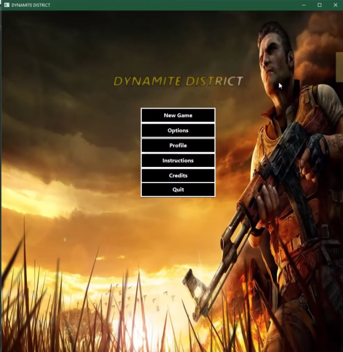
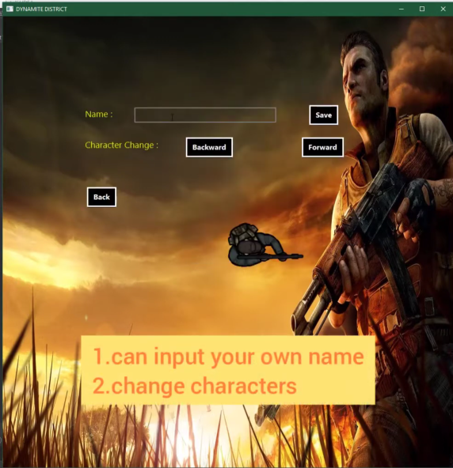
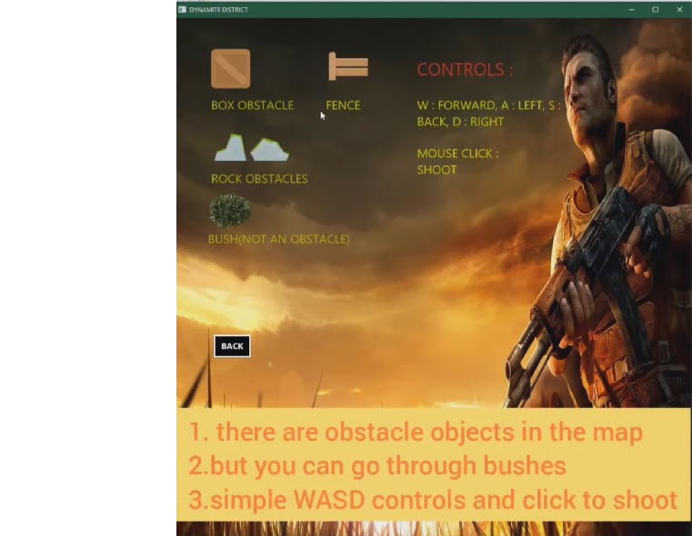

<a name="readme-top"></a>

<!-- PROJECT SHIELDS -->
[![Contributors][contributors-shield]][contributors-url]
[![Stargazers][stars-shield]][stars-url]
[![Youtube Link][youtube-shield]](https://youtu.be/0LY7aH5CYJ8)


<!-- PROJECT LOGO -->
<br />
<div align="center">
  <a href="https://github.com/mrmajumder/Dynamite-District">
    
  </a>

<h3 align="center">Dynamite District</h3>
  <p align="center">
    A Java-based Multiplayer Shooting Game
    <br />
    <br />
  </p>
</div>


<!-- TABLE OF CONTENTS -->
<details>
  <summary>Table of Contents</summary>
  <ol>
    <li>
      <a href="#about-the-project">About The Project</a>
      <ul>
        <li><a href="#built-with">Built With</a></li>
        <li><a href="#project-images">Project Images</a></li>
      </ul>
    </li>
    <li>
      <a href="#getting-started">Getting Started</a>
      <ul>
        <li><a href="#prerequisites">Prerequisites</a></li>
        <li><a href="#installation">Installation</a></li>
      </ul>
    </li>
    <li><a href="#contributors">Contributors</a></li>
    <li><a href="#acknowledgments">Acknowledgments</a></li>
  </ol>
</details>


<!-- ABOUT THE PROJECT -->
## About The Project

This project was developed as a final term project for the course "CSE 108: Object Oriented Programming Language Sessional". The project is a java-based multiplayer battle-royale game, featuring shooting, 2D movement and time-based deathmatches among multiple players over LAN or the web.

The project is mainly made with Java as the backend language, and the library JavaFX was used for frontend designing.

This project received full marks with bonus.

<p align="right">(<a href="#readme-top">back to top</a>)</p>


### Built With
Java and JavaFX library.

<p align="right">(<a href="#readme-top">back to top</a>)</p>


### Project Images
<p float="left" align="middle">
  
   
  
</p>
<p align="right">(<a href="#readme-top">back to top</a>)</p>

### Demo Gameplay


<p align="right">(<a href="#readme-top">back to top</a>)</p>


<!-- GETTING STARTED -->
## Getting Started

This is an example of how you may set up this project locally. To get a local copy up and running follow these simple example steps.

### Prerequisites
  ```sh
  Java must be installed
  ```

### Installation

1. Clone the repo
   ```sh
   git clone https://github.com/mrmajumder/Dynamite-District.git
   ```
2. Navigate to the `dist` folder
3. Run `Example.jar` to run the program. You may want to run multiple instances/machines to play the game in multiplayer mode.

<p align="right">(<a href="#readme-top">back to top</a>)</p>


<!-- CONTRIBUTING -->
## Contributors

* Shafayat Hossain Majumder - [GitHub][github-url] | [LinkedIn][linkedin-url] | [Mail][email] | [Website][website-url]
* Sourov Jajodia - [GitHub](https://github.com/Sourov72) | [LinkedIn](https://www.linkedin.com/in/sourov72) | [Mail](mailto:sourov.jajodia72@gmail.com) | [Website](https://sourov72.github.io)


<p align="right">(<a href="#readme-top">back to top</a>)</p>


<!-- ACKNOWLEDGMENTS -->
## Acknowledgments

* [Tarikul Islam Papon](https://www.linkedin.com/in/tarikul-islam-papon-264581191/) - then lecturer at CSE, BUET and supervisor of this project

<p align="right">(<a href="#readme-top">back to top</a>)</p>


<!-- MARKDOWN LINKS & IMAGES -->
<!-- https://www.markdownguide.org/basic-syntax/#reference-style-links -->
[contributors-shield]: https://img.shields.io/github/contributors/mrmajumder/Dynamite-District.svg?style=for-the-badge
[contributors-url]: https://github.com/mrmajumder/Dynamite-District/graphs/contributors
[forks-shield]: https://img.shields.io/github/forks/mrmajumder/Dynamite-District.svg?style=for-the-badge
[forks-url]: https://github.com/mrmajumder/Dynamite-District/network/members
[stars-shield]: https://img.shields.io/github/stars/mrmajumder/Dynamite-District.svg?style=for-the-badge
[stars-url]: https://github.com/mrmajumder/Dynamite-District/stargazers
[issues-shield]: https://img.shields.io/github/issues/mrmajumder/Dynamite-District.svg?style=for-the-badge
[issues-url]: https://github.com/mrmajumder/Dynamite-District/issues
[license-shield]: https://img.shields.io/github/license/mrmajumder/Dynamite-District.svg?style=for-the-badge
[license-url]: https://github.com/mrmajumder/Dynamite-District/blob/master/LICENSE.txt
[linkedin-shield]: https://img.shields.io/badge/-LinkedIn-black.svg?style=for-the-badge&logo=linkedin&colorB=555
[linkedin-url]: https://linkedin.com/in/monsieurmajumder
[youtube-shield]: https://img.shields.io/badge/Video%20Demo-FF0000?style=for-the-badge&logo=youtube&logoColor=white
[github-url]: https://github.com/MrMajumder/
[email]: mailto:monsieurmajumder@gmail.com
[website-url]: https://mrmajumder.github.io/

[product-screenshot]: images/screenshot.png
[Next.js]: https://img.shields.io/badge/next.js-000000?style=for-the-badge&logo=nextdotjs&logoColor=white
[Next-url]: https://nextjs.org/
[React.js]: https://img.shields.io/badge/React-20232A?style=for-the-badge&logo=react&logoColor=61DAFB
[React-url]: https://reactjs.org/
[Vue.js]: https://img.shields.io/badge/Vue.js-35495E?style=for-the-badge&logo=vuedotjs&logoColor=4FC08D
[Vue-url]: https://vuejs.org/
[Angular.io]: https://img.shields.io/badge/Angular-DD0031?style=for-the-badge&logo=angular&logoColor=white
[Angular-url]: https://angular.io/
[Svelte.dev]: https://img.shields.io/badge/Svelte-4A4A55?style=for-the-badge&logo=svelte&logoColor=FF3E00
[Svelte-url]: https://svelte.dev/
[Laravel.com]: https://img.shields.io/badge/Laravel-FF2D20?style=for-the-badge&logo=laravel&logoColor=white
[Laravel-url]: https://laravel.com
[Bootstrap.com]: https://img.shields.io/badge/Bootstrap-563D7C?style=for-the-badge&logo=bootstrap&logoColor=white
[Bootstrap-url]: https://getbootstrap.com
[JQuery.com]: https://img.shields.io/badge/jQuery-0769AD?style=for-the-badge&logo=jquery&logoColor=white
[JQuery-url]: https://jquery.com 
